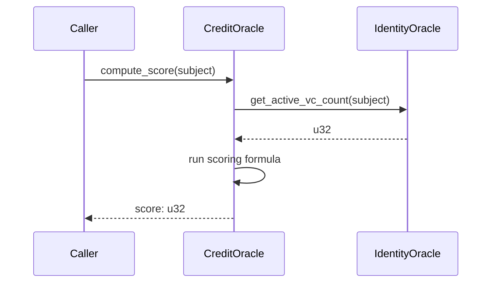

# Architecture Overview

stellar-did-credit is a three-contract protocol on Stellar/Soroban that lets any wallet address build a verifiable, portable credit identity. An off-chain TypeScript SDK wraps the contracts for application developers. The contracts are fully independent — each can be upgraded or replaced without breaking the others — and communicate only through explicit cross-contract calls or off-chain coordination via the feeder role.

---

## System diagram

```mermaid
graph TD
    CON_APP[Application / Lender UI]
    CON_SDK[TypeScript SDK]

    SC_ID[identity-oracle\nCATORJPJ...]
    SC_CR[credit-oracle\nCBMMX6GJ...]
    SC_RV[revocation-registry\nCDNQLXKK...]

    OFF_FEEDER[Trusted Feeder\noff-chain indexer]
    OFF_ISSUER[Credential Issuer]
    OFF_SUBJECT[Subject / Wallet]

    OFF_SUBJECT -->|anchor_did| SC_ID
    OFF_ISSUER  -->|anchor_vc| SC_ID
    OFF_ISSUER  -->|revoke| SC_RV
    SC_ID       -.->|mark_vc_revoked| SC_ID

    OFF_FEEDER  -->|set_vc_count\nupdate_tx_stats| SC_CR
    CON_APP     -->|record_repayment| SC_CR
    CON_APP     -->|compute_score| SC_CR
    SC_CR       -->|get_active_vc_count\n(if IdentityOracleId set)| SC_ID
    SC_CR       -.->|read VcCount\n(if IdentityOracleId NOT set)| SC_CR

    CON_SDK     -->|getScore\nisVerified\nanchorDID\nissueVC| SC_ID
    CON_SDK     -->|getScore| SC_CR
    CON_APP     --> CON_SDK
```

---

## Contracts

### identity-oracle

Stores decentralised identifiers (DIDs) and verifiable credential (VC) anchors for subjects. It is the source of truth for whether a wallet address has been verified by a trusted issuer.

#### Admin setup

The protocol admin must register each trusted issuer before that address can call `anchor_vc`. This is done through `register_issuer(admin, issuer)` on the identity-oracle contract; the admin can later revoke trust with `deregister_issuer`.

**Key functions**

| Function                                    | Caller   | Description                                                 |
| ------------------------------------------- | -------- | ----------------------------------------------------------- |
| `initialize(admin)`                         | deployer | Sets the contract administrator                             |
| `set_revocation_registry(registry_id)`       | admin    | Links the revocation-registry contract (REQUIRED for cross-contract revocation checks) |
| `get_revocation_registry()`                  | anyone   | Returns the linked revocation-registry address or `None`     |
| `register_issuer(admin, issuer)`            | admin    | Whitelists a credential issuer                              |
| `anchor_did(subject, did_doc_cid)`          | subject  | Stores an IPFS CID pointing to the subject's DID document   |
| `anchor_vc(issuer, subject, vc_hash)`       | issuer   | Records a SHA-256 hash of an off-chain VC                   |
| `mark_vc_revoked(issuer, subject, vc_hash)` | issuer   | Marks a specific VC as revoked                              |
| `is_verified(subject)`                      | anyone   | Returns true if the subject has at least one non-revoked VC |
| `get_active_vc_count(subject)`              | anyone   | Returns the cached active VC count; seeded lazily from existing anchors and then maintained on `anchor_vc` / `mark_vc_revoked` |
| `verify_vc(subject, vc_hash)`               | anyone   | Returns true if a specific VC exists and is not revoked     |

**Storage layout**

| Key                      | Type            | Description                                            |
| ------------------------ | --------------- | ------------------------------------------------------ |
| `Admin`                  | `Address`       | Instance storage — contract admin                      |
| `TrustedIssuer(Address)` | `bool`          | Persistent — tombstone flag: `true` while a registered issuer is trusted, `false` once deregistered |
| `IssuersIndex`           | `Vec<Address>`  | Persistent — append-only list of every address ever registered; `list_issuers()` filters this against `TrustedIssuer` |
| `DIDDocument(Address)`   | `String`        | Persistent — IPFS CID of the subject's DID document    |
| `VCAnchors(Address)`     | `Vec<VCRecord>` | Persistent — list of VC anchor records for a subject   |
| `ActiveVCCount(Address)` | `u32`           | Persistent — cached count of active VC anchors for the subject |

| `VCAnchors(Address)`     | `Vec<VCRecord>` | Persistent — list of VC anchor records for a subject   || `VCAnchors(Address)`     | `Vec<VCRecord>` | Persistent — list of VC anchor records for a subject   |
| `RevocationRegistryId`   | `Address`       | Instance storage � linked revocation-registry contract address (optional, set via `set_revocation_registry`) |

---

### credit-oracle

Computes and stores a credit score (300–850) for any subject address. It relies on three data inputs: VC count (fed by a trusted feeder), transaction statistics (fed by a trusted feeder), and repayment history (recorded by trusted lenders). The scoring formula is deterministic and fully on-chain.

**Key functions**

| Function                                             | Caller   | Description                                        |
| ---------------------------------------------------- | -------- | -------------------------------------------------- |
| `initialize(admin)`                                  | deployer | Sets admin and default scoring weights (40/30/30)  |
| `register_feeder(admin, feeder)`                     | admin    | Whitelists a data feeder                           |
| `register_lender(admin, lender)`                     | admin    | Whitelists a lender                                |
| `set_vc_count(feeder, subject, count)`               | feeder   | Caches the subject's VC count from identity-oracle |
| `update_tx_stats(feeder, subject, stats)`            | feeder   | Updates 30-day transaction volume and count        |
| `record_repayment(lender, subject, amount, on_time)` | lender   | Records a repayment event; current v1 behavior does not verify a real loan relationship and should be treated as a lender attestation rather than proof of disbursement |
| `compute_score(subject)`                             | anyone   | Runs the scoring formula and persists the result   |
| `get_score(subject)`                                 | anyone   | Returns the last computed ScoreRecord              |
| `update_weights(weights)`                            | admin    | Changes scoring weights (must sum to 100)          |
| `flag_score_input(subject, input_key, reason)`       | subject  | Files a dispute against a specific score input     |
| `resolve_dispute(subject, input_key, accepted)`      | admin    | Accepts or rejects a pending dispute               |
| `get_dispute(subject, input_key)`                    | anyone   | Returns a dispute record or None                   |
| `list_disputes(subject)`                             | anyone   | Lists all dispute records for a subject            |

**Storage layout**

| Key                        | Type              | Description                                       |
| -------------------------- | ----------------- | ------------------------------------------------- |
| `Admin`                    | `Address`         | Instance storage — contract admin                 |
| `Config`                   | `ScoringWeights`  | Instance storage — vc/tx/repayment weights        |
| `TrustedFeeder(Address)`   | `bool`            | Persistent — registered feeder flag               |
| `TrustedLender(Address)`   | `bool`            | Persistent — registered lender flag               |
| `TxStats(Address)`         | `TxStats`         | Persistent — 30-day tx volume and count           |
| `RepaymentRecord(Address)` | `RepaymentRecord` | Persistent — on-time and total repayment counts   |
| `VcCount(Address)`         | `u32`             | Persistent — cached VC count from identity-oracle |
| `Score(Address)`           | `ScoreRecord`     | Persistent — last computed score with metadata    |

---

### revocation-registry

A minimal, standalone registry that maps VC hashes to their revocation status. It is intentionally separate from identity-oracle so that revocation can be checked by any party without needing to traverse the full VC anchor list.

**Key functions**

| Function                          | Caller   | Description                                   |
| --------------------------------- | -------- | --------------------------------------------- |
| `initialize(admin)`               | deployer | Sets the contract administrator               |
| `revoke(issuer, vc_hash)`         | issuer   | Marks a VC hash as revoked (issuer authority enforced per `vc_hash`) |
| `batch_revoke(issuer, vc_hashes)` | issuer   | Revokes multiple VC hashes in one transaction (issuer authority enforced per `vc_hash`) |

| `is_revoked(vc_hash)`             | anyone   | Returns true if the hash has been revoked     |

**Storage layout**

| Key                      | Type      | Description                                 |
| ------------------------ | --------- | ------------------------------------------- |
| `Admin`                  | `Address` | Instance storage — contract admin           |
| `Status(BytesN<32>)`     | `bool`    | Persistent — revocation flag for a VC hash  |
| `RegisteredVCIssuer(BytesN<32>)` | `Address` | Persistent — authority that is allowed to revoke this hash (first issuer wins) |
| `IssuerOfVC(BytesN<32>)` | `Address` | Persistent — which issuer performed the latest revoke call for this hash |


---

## Admin Transfer Two-Step Flow

All three contracts (`identity-oracle`, `credit-oracle`, and `revocation-registry`) use a two-step process to transfer the `Admin` role to a new address. This design ensures that the contract never ends up in an unrecoverable state if an incorrect admin address is accidentally proposed (e.g., a typo in the address, or an address the user doesn't possess the private key for).

### Flow Mechanics

1. **`propose_new_admin(env, new_admin)`**
    - **Caller**: The current `Admin`.
    - **Action**: Stores the `new_admin` address in the contract's instance storage under `DataKey::PendingAdmin`.
    - **Note**: The current admin retains full authority until the transfer is accepted.

2. **`accept_admin(env, new_admin)`**
    - **Caller**: The `new_admin` (the proposed pending admin).
    - **Action**: Reads the `PendingAdmin` from storage. If it matches the caller, the contract overwrites the main `Admin` key with the new address and clears the `PendingAdmin` key. The caller now holds full admin authority.

### Governance Edge Case

The `governance` contract acts as an automated admin for the `credit-oracle`. During deployment/setup, the deployer (acting as the initial `credit-oracle` admin) calls `propose_new_admin(gov_contract_address)`.

Subsequently, the `governance` contract calls its own `accept_oracle_admin()` function, which dynamically invokes `accept_admin` on the `credit-oracle`. Thus, the `governance` contract does not itself call `propose_new_admin` during its own adoption phase; it simply accepts the admin role that was already proposed to it by the deployer.

---
## Instance storage TTL management

Soroban entries have a limited time-to-live (TTL) measured in ledgers. If the TTL of a contract's **instance storage** entry reaches zero, the contract becomes archived — all its data is lost and it can never be called again. To prevent this, every function that reads or writes instance storage must periodically call `extend_ttl`.

### Pattern

Each contract defines two constants:

| Constant | Value | Purpose |
|---|---|---|
| `INSTANCE_BUMP_THRESHOLD` | 5 000 | Extend when fewer than ~7 hours of ledgers remain |
| `INSTANCE_BUMP_AMOUNT` | 500 000 | Extend TTL to ~30 days from now |

The call is placed after authentication succeeds in every admin-gated function:

```rust
env.storage().instance().extend_ttl(INSTANCE_BUMP_THRESHOLD, INSTANCE_BUMP_AMOUNT);
```

### Covered functions

All three contracts apply this pattern in `initialize` and every admin-gated function:

**identity-oracle**
- `initialize`, `register_issuer`, `deregister_issuer`, `upgrade`

**credit-oracle**
- `initialize`, `register_feeder`, `deregister_feeder`, `register_lender`, `deregister_lender`, `propose_weights`, `upgrade`

**revocation-registry**
- `initialize`, `upgrade`

Non-admin functions such as `anchor_did`, `anchor_vc`, `compute_score`, `revoke`, etc. touch only persistent storage and do not need to extend the instance TTL. If the contract is not called by an admin for an extended period, anyone can call any of the covered admin-gated functions (with admin authentication) to refresh the TTL.

> **Full treatment:** The [Epoch Model](epoch-model.md) document covers TTL management in depth — what each function bumps, what gets invalidated on expiry, and how to maintain liveness. It also explains related ledger-based mechanisms (compute cooldown, weight timelock, score staleness) that are not covered here.

---

## Cross-contract interaction

The `credit-oracle` supports a dual-path mechanism for resolving a subject's VC count during score computation. The active path depends on whether an `IdentityOracleId` is configured in the contract's instance storage.

### Cross-Contract Path (Live)

If `IdentityOracleId` is configured, `compute_score` dynamically queries the target contract:



In this path, the `credit-oracle` uses `env.invoke_contract` to obtain a live VC count directly from the `identity-oracle`. This ensures real-time accuracy but incurs cross-contract call overhead.

To keep that count path cheap, `identity-oracle` no longer re-checks the revocation registry for every anchored VC on every read. Instead, it caches the active count per subject, seeds the cache lazily from existing anchors on the first touch after upgrade, and then updates the counter incrementally when `anchor_vc` or `mark_vc_revoked` succeeds. The revocation-registry cross-contract lookup remains in the verification helpers and on new anchors so the cache stays aligned with the registry-backed revoke flow.

Benchmarking the cached read path in unit tests produced roughly flat CPU usage across 5, 10, and 20 VCs: 23,808, 23,520, and 25,470 instructions respectively. That is several orders of magnitude below Soroban's current mainnet per-invocation instruction ceiling (600,000,000), so the cached counter keeps `get_active_vc_count(subject)` comfortably within budget even for larger subjects.

### Fallback Path (Cached)

If `IdentityOracleId` is **not** set, `compute_score` falls back to reading a cached `VcCount` from persistent storage. This value is updated asynchronously by an off-chain trusted feeder calling `set_vc_count`.

While this avoids cross-contract overhead, the cached `VcCount` can become stale if the off-chain feeder halts or falls behind.

### Migration to Cross-Contract VC Count

To migrate a deployment from the cached fallback path to the live cross-contract path:

1. **Configure the Oracle ID**: The admin calls `set_identity_oracle(identity_oracle_id)` on `credit-oracle`.
2. **Path Switch**: Once the ID is set, all subsequent `compute_score` calls will automatically use the cross-contract lookup.
3. **Deprecate Feeder Input**: The trusted feeder should stop calling `set_vc_count`. Any further updates via `set_vc_count` will be successfully written to persistent storage but entirely ignored by `compute_score`.
4. **Failure Caveat**: There is no automatic fallback if the cross-contract call fails. If the configured `IdentityOracleId` points to an invalid contract or one that doesn't implement `get_active_vc_count`, the `compute_score` transaction will unconditionally fail.

---

## TTL management

Soroban persistent and instance storage entries have a time-to-live (TTL) measured in ledgers. If an entry's TTL expires, the entry is **archived** (removed from storage). To prevent data loss, all three contracts proactively extend TTLs on every write and provide an admin-only `maintain_storage` function for passive maintenance.

### Strategy: hybrid (automatic + maintenance)

1. **Automatic extension on every write** — whenever a contract writes to persistent storage (`set`), it immediately calls `extend_ttl` on that entry. This ensures actively-used data stays alive without any external coordination.

2. **`maintain_storage` admin function** — extends instance storage TTL (Admin, Config, PendingWeights). Can be called periodically by a cron job or manually to protect a contract whose configuration rarely changes.

### TTL constants

| Constant               | Value       | Approximate real time | Scope          |
| ---------------------- | ----------- | --------------------- | -------------- |
| `INST_TTL_THRESHOLD`   | 120 960     | ~7 days               | Instance       |
| `INST_TTL_EXTEND`      | 6 307 200   | ~1 year               | Instance       |
| `PERS_TTL_THRESHOLD`   | 120 960     | ~7 days               | Persistent     |
| `PERS_TTL_EXTEND`      | 518 400     | ~30 days              | Persistent     |

> Ledger time is calculated at ≈5 s/ledger (Stellar network average).

### Where TTL is extended

**identity-oracle**

| Operation          | Entry extended                    |
| ------------------ | --------------------------------- |
| `initialize`       | Instance storage (Admin)          |
| `register_issuer`  | `TrustedIssuer(issuer)`           |
| `anchor_did`       | `DIDDocument(subject)`            |
| `anchor_vc`        | `VCAnchors(subject)`              |
| `mark_vc_revoked`  | `VCAnchors(subject)`              |
| `maintain_storage` | Instance storage                  |

**credit-oracle**

| Operation            | Entry extended                              |
| -------------------- | ------------------------------------------- |
| `initialize`         | Instance storage (Admin, Config)            |
| `register_feeder`    | `TrustedFeeder(feeder)`                     |
| `register_lender`    | `TrustedLender(lender)`                     |
| `update_tx_stats`    | `TxStats(subject)`                          |
| `record_repayment`   | `RepaymentRecord(subject)`                  |
| `set_vc_count`       | `VcCount(subject)`                          |
| `compute_score`      | `Score(subject)`, `TxStats(subject)`, `RepaymentRecord(subject)`, `VcCount(subject)` |
| `maintain_storage`   | Instance storage                            |

**revocation-registry**

| Operation        | Entry extended                             |
| ---------------- | ------------------------------------------ |
| `initialize`     | Instance storage (Admin)                   |
| `revoke`         | `Status(vc_hash)`, `IssuerOfVC(vc_hash)`   |
| `batch_revoke`   | `Status(vc_hash)`, `IssuerOfVC(vc_hash)`   |
| `maintain_storage` | Instance storage                         |

### Maintenance recommendations

- Deploy an off-chain cron job (or serverless function) that calls `maintain_storage` on all three contracts at least once every **6 months** (well within the 1‑year instance TTL).
- No additional action is needed for persistent entries — their TTLs are extended automatically whenever they are written.
- If an entry has not been touched for more than ~30 days, it may be archived. This is by design: orphaned data can be garbage-collected by the network.

---

## Dispute Mechanism

Subjects can flag a specific score input as incorrect using `flag_score_input` on the `credit-oracle` contract. The admin reviews and resolves the dispute; a resolution event signals the off-chain feeder to re-fetch and correct the data.

### Who can dispute

Only the subject themselves (`subject.require_auth()`) may file a dispute. Admins resolve disputes; feeders re-sync data in response.

### What can be disputed

The `input_key` parameter must be one of three recognised values:

| `input_key`  | What it covers                                      |
| ------------ | --------------------------------------------------- |
| `tx_stats`   | 30-day transaction volume, count, counterparties    |
| `repayment`  | On-time / total repayment counts                    |
| `vc_count`   | Cached verifiable credential count                  |

### Anti-griefing

Only **one pending dispute per `(subject, input_key)` pair** is allowed at a time. Attempting to re-file while an existing dispute is `Pending` returns `DisputeAlreadyPending`. After the admin resolves a dispute (`Resolved` or `Rejected`), the subject may file a new one for the same key.

### Dispute lifecycle

```
[filed]    subject calls flag_score_input  ->  Pending
[accepted] admin calls resolve_dispute(accepted=true)  ->  Resolved
[rejected] admin calls resolve_dispute(accepted=false) ->  Rejected
[re-filed] after Resolved/Rejected, subject may file again ->  Pending
```

### Resolution and feeder re-sync

When the admin accepts a dispute, the contract emits a `DsptRslv` event containing `(subject, input_key)`. The off-chain feeder indexes this event, re-fetches the flagged data, and submits the correction via `update_tx_stats`, `record_repayment`, or `set_vc_count`. Anyone can then call `compute_score` to recompute with corrected inputs.

When the admin rejects a dispute, a `DsptRjct` event is emitted. The subject may re-file if they believe the data is still incorrect.

### Key functions (credit-oracle)

| Function | Caller | Description |
| -------- | ------ | ----------- |
| `flag_score_input(subject, input_key, reason)` | subject | Files a dispute against a score input |
| `resolve_dispute(subject, input_key, accepted)` | admin   | Accepts or rejects a pending dispute |
| `get_dispute(subject, input_key)`               | anyone  | Returns the dispute record, or `None` |
| `list_disputes(subject)`                        | anyone  | Returns all dispute records for a subject |

### Storage (credit-oracle)

| Key                        | Type            | Description |
| -------------------------- | --------------- | ----------- |
| `Dispute(Address, Symbol)` | `DisputeRecord` | Persistent - one record per (subject, input_key) pair |
| `DisputeIndex(Address)`    | `Vec<Symbol>`   | Persistent - index of all disputed input keys for a subject |

### Out of scope

- Off-chain dispute resolution processes
- Legal / compliance dispute handling
- Bond/stake economics (no bond required in this implementation)

---

## Future work

## Data flow narrative

### 1. Subject establishes identity

The subject calls `anchor_did` on identity-oracle with an IPFS CID pointing to their DID document (a JSON-LD file stored off-chain). This anchors their decentralised identifier on-chain and emits a `DIDAnch` event.

### 2. Issuer anchors a verifiable credential

A trusted issuer (registered by the admin) calls `anchor_vc` with the subject's address and the SHA-256 hash of an off-chain VC JSON. The VC itself stays off-chain; only its hash is stored. After this call, `is_verified(subject)` returns `true`.

### 3. Feeder updates credit inputs

An off-chain indexer (the feeder) monitors the subject's on-chain activity and periodically calls `set_vc_count` and `update_tx_stats` on credit-oracle to keep the non-identity scoring inputs fresh. The live VC count now comes from the cached `ActiveVCCount(Address)` inside identity-oracle, so the feeder no longer needs to read it for the cross-contract score path.

### 4. Lender records repayments

When a lender disburses a loan and the subject repays, the lender calls `record_repayment` on credit-oracle, flagging each repayment as on-time or late.

This is a deliberate v1 limitation: the contract currently accepts repayment data from any registered lender without verifying that the lender actually disbursed a loan to that subject. In other words, `record_repayment` is an attestation from a trusted lender, not proof of an existing loan relationship. A future version should add explicit loan-tracking state or signed disbursement/repayment attestations to close this gap.

### 5. Score is computed

Anyone (the subject, a lender, or an application) calls `compute_score(subject)`. The contract reads the three input components, runs the weighted formula, clamps the result to 300–850, and persists a `ScoreRecord`.

### 6. Consumer reads the score

A lender UI or the TypeScript SDK calls `get_score(subject)` to read the last computed `ScoreRecord`. The SDK's `getScore()` method does this via a read-only simulation — no transaction fees required.

---

## Architecture Decision Records

### ADR-001 — `compute_score` requires no authorisation

**Status:** Accepted

**Context**

`compute_score(subject)` in `credit-oracle` writes a `ScoreRecord` to persistent
storage but requires no `require_auth()` call. During the initial security review
the absence of an auth check was flagged as potentially unintentional.

**Decision**

The open-call design is intentional. The function reads only data that has
already been submitted by trusted parties (feeders and lenders) and writes only
the subject's own score record. There is no way for an adversarial caller to
inflate, deflate, or corrupt a score beyond what the on-chain inputs support.
Keeping the function permissionless:

- allows lenders and applications to refresh a score without holding a subject
  signature,
- lets the off-chain feeder refresh scores in the same transaction as a data
  update, and
- treats score computation as a public utility rather than a privileged action.

**Consequences**

Successful recomputations are rate-limited per subject by the configured
`ComputeCooldownLedgers` value. The default interval is one ledger, which
prevents same-ledger timestamp grinding while preserving the open-call design.
The last successful computation ledger is stored as `LastComputed(Address)`, and
admin/governance can update the interval with `update_compute_cooldown`.

---

### ADR-002 — Uniform `require_admin` helper across all three contracts

**Status:** Accepted

**Context**

Prior to this change the three contracts used two different admin-auth styles:

- `update_weights` / `propose_weights` called `stored_admin.require_auth()`
  directly after loading the admin from storage (implicit lookup).
- `register_feeder`, `register_lender`, `register_issuer` etc. required the
  caller to pass `admin` as an explicit parameter, then compared it against
  storage before calling `require_auth()` on the passed-in value.

The mixed styles made the auth model hard to reason about and audit.

**Decision**

Extract a private `fn require_admin(env: &Env) -> Address` in each contract.
The helper loads the stored admin, immediately calls `require_auth()` on it, and
returns the address. Every admin-gated function now calls `require_admin` first,
then (for the explicit-parameter variants) compares the returned address to the
caller-supplied `admin` to preserve the existing API surface.

**Consequences**

- A single read path for the admin address — easier to audit.
- `require_auth()` is always called on the *stored* admin, not on an
  unvalidated caller-supplied value.
- The public function signatures are unchanged; no SDK or script updates needed.

---

### ADR-003 — Governance weight changes respect credit-oracle timelock

**Status:** Accepted

**Context**

The governance contract can update credit-oracle scoring weights through a community vote. Initially, `Governance::execute` called `CreditOracleClient::update_weights()` directly, which immediately applied the new weights without any waiting period. This bypassed the credit-oracle's built-in timelock mechanism (`propose_weights` + `apply_weights`) designed to give the community time to react to weight changes.

**Decision**

Governance `execute` now calls `propose_weights` instead of `update_weights`. This queues the weight change in the credit-oracle's pending state with a 24-hour timelock (17,280 ledgers). A separate `apply_weights` function must be called after the timelock expires to finalize the change.

**Flow:**

1. **Proposal creation**: A proposer creates a governance proposal with new weights and a voting period.
2. **Voting**: Voters cast votes for or against during the voting period.
3. **Execution**: After the voting period ends and if quorum is met and votes_for > votes_against, `execute` calls `propose_weights` on credit-oracle, starting the timelock.
4. **Timelock period**: ~24 hours (17,280 ledgers) during which the community can review the pending weights.
5. **Application**: Anyone calls `apply_weights` to finalize the change after the timelock expires.

**Consequences**

- Weight changes require both voting period + timelock, providing ample time for community reaction.
- The `get_scoring_weights` function returns active weights; pending weights are available via `get_pending_weights`.
- Anyone can call `apply_weights` after the timelock expires, making the finalization permissionless.

---

## Event Indexing

For a detailed catalog of events emitted by the smart contracts and instructions on subscribing to them for off-chain sync, see the [Event Indexing Guide](event-indexing.md).
